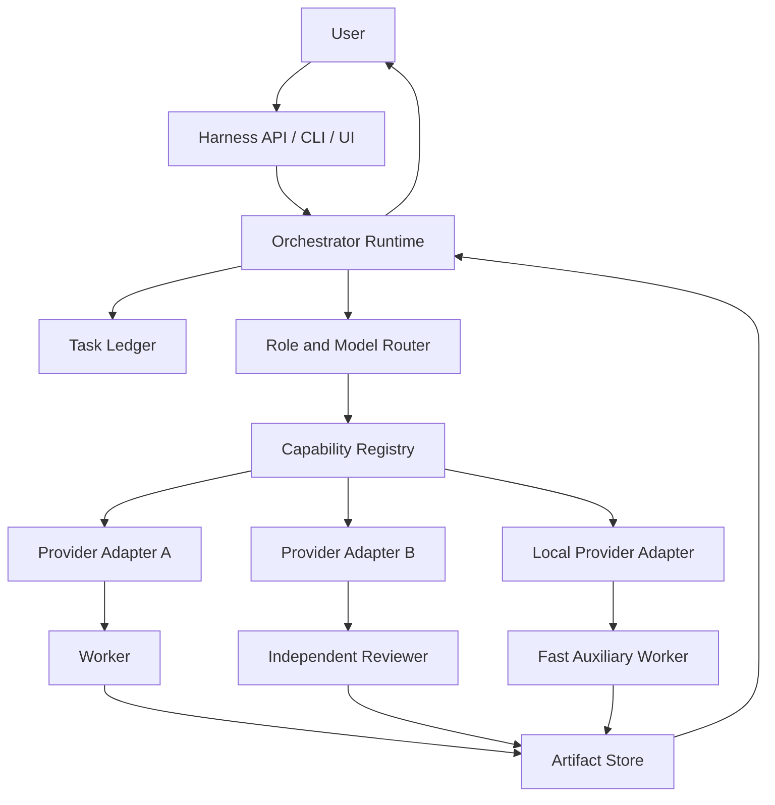

# Synorch Multi-Provider Agent Harness — Future Vision

> Status: Proposal and future plan
> Implementation status: Not implemented yet
> Last updated: 2026-09-22
> Related current document: [AI Orchestration Architecture](./AI-ORCHESTRATION-ARCHITECTURE.md)

## 1. Executive Summary

Today Synorch is a Node.js CLI that generates provider-neutral agent, skill and protocol structures for host agent environments such as Codex and Claude Code. Through the `inspect`, `init`, `sync` and `doctor` commands, it installs and validates orchestration contracts inside a repository or workspace. It is not a continuously running agent runtime; it makes no model calls, connects to no provider accounts, and does not operate worker processes itself.

This document defines the **multi-provider agent harness** vision that Synorch could evolve into. That future layer would be able to securely connect the different AI provider accounts the user authorizes, run different models in different roles under a main orchestrator, persist task state, and manage the implementation-to-review flow across models.

An example target flow:

```text
User
   │
   ▼
Main Orchestrator
   ├── Provider A / Model X → analysis and planning
   ├── Provider B / Model Y → implementation
   ├── Provider C / Model Z → independent review
   └── Local model          → low-cost auxiliary work
```

The model and provider names here are examples only. Real support will depend on each provider's official authentication paths, terms of use, and runtime capability discovery.

## 2. Why a Harness?

A model on its own can reason and produce; but a reliable software development organization additionally requires the following operational responsibilities:

- Analyzing the work and splitting it into subtasks.
- Choosing the right role and model for each subtask.
- Giving workers sufficient but bounded context.
- Managing file ownership and isolation.
- Persisting task, attempt and approval state.
- Implementing timeout, retry, cancellation and error recovery behavior.
- Separating implementation from independent review.
- Observing provider usage, quota and cost.
- Recording every significant decision and piece of evidence in an auditable form.

The operational layer that takes on these responsibilities is called an **agent harness**.

## 3. Relationship to Today's Synorch

The future harness will not supersede the current project. Today's structure can form the harness's provider-neutral contract and policy core.

```text
Synorch Core
├── Agent and skill contracts
├── Task/context/completion packet schemas
├── Risk, approval and verification protocols
└── Provider-neutral role and capability vocabulary

Synorch CLI
├── syn inspect
├── syn init
├── syn sync
└── syn doctor

Synorch Harness / Runtime
├── Provider authentication
├── Model and capability registry
├── Orchestrator and worker lifecycle
├── Task ledger and scheduler
├── Isolation, review and recovery
└── Usage, cost and audit records

Optional Synorch UI
├── Account and provider connections
├── Task view
├── Approval and intervention screens
└── Usage and health panels
```

In the short term the CLI must stay lightweight and predictable. The runtime can start as a separate package inside the same repository; once the product and security boundaries mature, the separate-repository decision can be reconsidered.

## 4. Terminology

### Main orchestrator

The control-plane agent that takes the user's goal and is responsible for analysis, planning, task distribution, monitoring, review synthesis and the final report. By default it does not modify product files directly.

### Worker

An agent instance that works on a bounded task packet. It may hold a role such as implementer, explorer, debugger or reviewer.

### Provider

A service or local execution environment that provides access to a model. It may have different authentication forms such as OAuth, device-code, API key, an enterprise gateway or a local endpoint.

### Model

A reasoning or generation engine accessed through a provider. The model identity must be kept separate from the provider identity.

### Harness

The operating system that manages task, context, tool, identity, isolation, verification and lifecycle for orchestrators and workers.

### Runtime

The set of long-lived processes or services that actually execute harness policies and can retain state across sessions.

## 5. Goals

- Run models from different providers together in a single task graph.
- Route by role and capability rather than by model name.
- Connect the user's existing accounts only through official and authorized methods.
- Preserve the same task and evidence contracts even when the provider changes.
- Keep the main orchestrator, implementer and reviewer roles separate from each other.
- Resume tasks after an interruption.
- Apply visible and approved recovery instead of silent fallback.
- Bound context cost and reduce rediscovery.
- Leave an audit trail for every significant decision, model call and file change.
- Establish boundaries that can support local, remote or hybrid deployment options.

## 6. Non-Goals

The following should not be targeted in the first releases:

- Behaving as though every provider's consumer subscription were supported.
- Imitating browser cookies or closed authentication flows.
- Developing methods aimed at circumventing provider terms of use.
- Switching to a paid or high-cost model without user approval.
- Building a swarm in which models talk to each other without limits or oversight.
- Turning into a general-purpose workflow automation platform at this first stage.
- Making the Synorch CLI's current deterministic scaffold behavior depend on the runtime.

## 7. Proposed High-Level Architecture



### Control flow

The control flow carries approval, routing, state transition, retry and lifecycle decisions. The main orchestrator and the task ledger sit at the center of this flow.

### Data flow

The data flow carries context packets, diffs, test output, review findings and other artifacts. Large artifacts should be handed over by reference rather than copied into the prompt.

Control flow and data flow must be separated. Credentials must not be part of a task context or an artifact package.

## 8. Provider Authentication and Credential Security

Every provider adapter must use only the methods the provider officially supports:

- OAuth 2.0 or device-code.
- An API key the user explicitly supplies.
- An enterprise identity provider or gateway.
- A local endpoint managed by the user.

Credential rules:

- Tokens and secrets are never written into the task ledger, the logs or the model context.
- The operating system credential vault or equivalent encrypted storage is used.
- Refresh token access is constrained by the principle of least privilege.
- Log redaction must be the default and must be tested.
- When a provider connection is removed, the associated credential must be deleted in a recoverable manner.
- A worker should only see a short-lived provider handle created for it.
- Credential export should be forbidden by default.

The existence of a subscription does not imply a third-party right of use. Capability discovery must make the following distinction explicit:

| Access type | Example situation | Harness behavior |
|---|---|---|
| Official OAuth/device-code | The provider explicitly supports it | Can be connected with user approval |
| Official API key | The user supplies a key | Separate billing and quota are shown |
| Consumer subscription unclear | The plan's coverage is undocumented | Support is not assumed; an explicit warning is shown |
| Closed/reverse-engineered flow | No official support | Not used |
| Local model | The user manages the endpoint | Health and capability probes are applied |

## 9. Provider Adapter Contract

Every adapter must implement a common contract:

```yaml
provider_id: provider-a
authentication:
  methods: [oauth_device, api_key]
capabilities:
  model_listing: supported
  streaming: supported
  tool_calling: supported
  per_worker_model_selection: supported
  usage_reporting: degraded
  cancellation: supported
  session_resume: unsupported
```

An adapter must define at least the following operations:

- `authenticate`
- `refreshAuthentication`
- `listModels`
- `probeCapabilities`
- `startInvocation`
- `streamInvocation`
- `cancelInvocation`
- `readUsage`
- `revokeAuthentication`

Every capability must be reported as `supported`, `degraded` or `unsupported`. An unsupported feature must not be imitated as though it existed.

## 10. Model and Capability Registry

A routing decision must not look at the model name alone. At runtime the registry must hold the following facts:

- Provider and model identity.
- Context capacity.
- Tool calling and structured output support.
- Verified capabilities such as coding, review, vision or long context.
- Latency and cost class.
- Rate limit and, where available, a summary of remaining quota.
- Authentication health.
- Data residency and enterprise policy labels.
- Last verification time and the evidence source.

Static config only expresses a preference. Actual availability must be verified with a capability probe.

## 11. Role-Based Model Routing

The canonical policy must describe the need rather than the model name:

```yaml
roles:
  orchestrator:
    requires: [strong_reasoning, long_context, delegation]
  implementer:
    requires: [coding, tool_calling, patch_generation]
  reviewer:
    requires: [code_review, structured_output]
    prefers: [independent_provider]
  fast_worker:
    requires: [low_latency]
```

The router must decide in the following order:

1. The user's explicit provider/model choice.
2. Security, data residency and task policies.
3. The role's mandatory capabilities.
4. Provider health and quota status.
5. Cost/latency preferences set by the user.
6. An explainable tie-break rule.

If the chosen model is unavailable, no silent fallback occurs. The harness asks for user approval while showing the reason, the alternatives and the cost impact.

## 12. Cross-Provider Implementation and Review Example

```text
1. The main orchestrator creates the task and the acceptance criteria.
2. The router selects an implementer with suitable coding capability.
3. The implementer makes the change in an isolated workspace.
4. The harness attaches diff, command and test evidence to the completion packet.
5. Where possible, the router selects an independent reviewer from a different provider.
6. The reviewer examines the plan, the diff and the evidence.
7. If there are findings, the orchestrator produces a new delta packet.
8. The implementer fixes them; the reviewer re-checks only the necessary area.
9. The main orchestrator synthesizes the acceptance criteria and reports to the user.
```

Using different providers can strengthen independence, but on its own it is not a quality guarantee. The reviewer must have its own separate context, task and evidence contract.

## 13. The Task Ledger and State Machine

The runtime must not keep tasks only in the conversation history. A persistent task ledger must contain at least the following:

- Task, run and attempt identifiers.
- The user goal and the approved plan version.
- The risk level.
- The task dependency graph.
- The assigned role, provider and model.
- Owned, readable and forbidden paths.
- The context packet version and digest.
- Approval records.
- Artifact and evidence references.
- Retry, timeout and failure reasons.
- A usage and cost summary.

The proposed lifecycle:

```text
DRAFT
  ↓
AWAITING_APPROVAL
  ↓
READY
  ↓
RUNNING
  ├── NEEDS_CONTEXT ──→ RUNNING
  ├── BLOCKED ────────→ READY
  ├── FAILED ─────────→ RETRY_PENDING
  ├── CANCELLED
  └── VERIFYING
          ↓
       REVIEWING
          ├── CHANGES_REQUESTED ──→ READY
          └── COMPLETED
```

Every state transition must be recorded with its actor, time, reason and previous state.

## 14. Context, Completion and Review Packets

Typed packets must be used as the common language between providers.

### Task context packet

- Objective and rationale.
- Risk level and approval reference.
- Owned/read/forbidden scope.
- Verified facts including source and revision.
- Relevant symbols and artifact references.
- Acceptance criteria.
- Verification commands.
- Non-goals.
- Stop and escalation conditions.

### Worker completion packet

- Status and a short summary.
- Changed files.
- Decisions taken.
- Commands run and their exit codes.
- Evidence for every acceptance criterion.
- Skipped checks and the reasons for skipping them.
- Remaining risks.

### Review packet

- The digests of the reviewed plan, diff and evidence.
- Reviewer provider/model and independence information.
- Findings classified by severity.
- File, location, impact and recommendation for every finding.
- The accept, request-changes or block decision.

Large conversation histories must not be copied to workers. Follow-up tasks must use a versioned delta packet instead of the full packet.

## 15. Isolation and Parallelism

The proposed initial policy:

- Within a single file tree, only work with disjoint ownership runs in parallel.
- Work on the same file or on a shared generated artifact is serialized.
- Broad, high-risk work, or work with a chance of conflict, uses a worktree/isolated checkout.
- An integration owner moves worker results onto the target branch.
- A worker cannot revert another worker's change.
- An ownership violation is stopped automatically and escalated to the orchestrator.

If a provider does not support worktrees, the capability must be `degraded` and safer serial execution must be applied.

## 16. Approval, Retry, Timeout and Fallback

### Approval

User approval is required at least in the following cases:

- Moving a plan into execution.
- Using a new paid provider or a more expensive model.
- A destructive operation.
- Writing to a credential or an external system.
- Scope expansion beyond the plan.
- A non-silent model/provider change.

### Retry

A retry is performed only with a materially changed hypothesis or instruction. Repeating the same prompt indefinitely is forbidden. The attempt count and its cost must be visible in the ledger.

### Timeout and cancellation

The harness must be able to cancel a provider request, close down the worker state and mark the partial artifacts that were produced. Cancelled output cannot be used as completed evidence.

### Fallback

The fallback policy is defined explicitly by the user. The default behavior is not a silent provider/model switch, but stopping to explain and ask for approval.

## 17. Usage, Quota and Cost

Different providers may expose usage information at different levels of detail. The harness must preserve the following distinction:

- Token/cost data verified by the provider.
- Usage data estimated by the harness.
- Usage assumed to be within a subscription but not verifiable.

Estimates must not be presented as an actual bill. The user must be able to set a budget limit per task or per provider. When the budget is exceeded, no new call should be started, and the behavior of active calls must be determined by an explicit policy.

## 18. Auditability and Observability

For every run, the following records must be accessible:

- Which decision was made by whom.
- Which provider/model was chosen and why.
- The digest of the packet that was sent.
- A summary of tool and file access.
- The artifacts produced.
- Test and review evidence.
- Retry, fallback and approval events.
- Duration, usage and cost information.

Logs must not carry secrets, tokens or unnecessary user content. Detailed tracing may be opt-in; a basic audit trail must be the default.

## 19. Threat Model

The initial security design must cover at least the following risks:

- Credential leakage.
- Unauthorized access to another provider or tool through prompt injection.
- A worker writing outside its ownership.
- Malicious repository instructions overriding constitutional rules.
- Secrets being carried through logs or artifacts.
- Provider endpoint spoofing and SSRF.
- Trusting model output directly as a shell command.
- Supply-chain-sourced skill/plugin manipulation.
- The reviewer and the implementer sharing the same tainted context.
- Budget-consuming infinite retry or agent loops.

Defenses must include credential isolation, allowlists, sandboxing, path boundaries, approval gates, signed/digested artifacts, a maximum attempt count and immutable audit records.

## 20. Deployment Options

### Local runtime

Runs on a single developer's machine. Credential control and repository access are simple; tasks stop when the device shuts down.

### Local daemon and UI

A service running in the background, offering a CLI and a desktop/web interface. Suitable for long-running tasks and notifications.

### Self-hosted server

Provides team usage, central policy and a shared queue. Multi-tenant isolation and secret management require a higher level of security.

### Hybrid model

The control plane can live on a server while the repository and tool execution live on a local runner. Valuable for enterprise data residency, but it complicates protocol and identity design.

Local execution is recommended for the first experimental runtime. A multi-user cloud service should not be a first-stage goal.

## 21. Relationship to Hermes Agent

Hermes Agent is an important source of inspiration in terms of provider configuration, model selection, OAuth/API connections and the agent working experience. Synorch's proposed differentiation is:

- Explicit orchestrator/worker/reviewer roles for software development tasks.
- Provider-neutral typed task and evidence packets.
- Risk-proportional independent review.
- File ownership and worktree isolation.
- Repository-aware discovery and skill activation.
- No-silent-fallback and approval-first routing.
- The CLI scaffold and the runtime contracts sharing the same core.

This document is not a commitment to Hermes compatibility or to reimplementing existing Hermes features. Before implementation, the licenses of the relevant projects, their current documentation, and provider terms of use must be reviewed separately.

## 22. Phased Roadmap

### Phase 0 — Contract foundation

- Canonical Agent Manifest v1.
- Canonical Skill Contract v1.
- Task Context, Completion and Review Packet v2.
- Agent and protocol registry.
- A provider capability vocabulary.
- Contract validation and negative tests for `doctor`.

Exit criterion: Even without a runtime, all canonical contracts must be consistent and machine-verifiable in the generated project.

### Phase 1 — Local single-provider harness prototype

- A single provider adapter.
- A local task ledger.
- One orchestrator and one worker lifecycle.
- Approval, cancellation and timeout.
- An artifact store and a basic audit log.

Exit criterion: A single task must be able to resume after an interruption, and every state transition must be explainable.

### Phase 2 — Multi-provider routing

- At least two official provider adapters.
- Capability discovery.
- Role-based model routing.
- The cross-provider implementer/reviewer flow.
- Quota and usage visibility.

Exit criterion: Implementation on one provider and independent review on another must be completable with a routing decision that is visible to the user.

### Phase 3 — Isolation and recovery

- Worktree or equivalent sandbox management.
- Ownership enforcement.
- Retry and delta-context flows.
- Worker crash recovery.
- Stale context and artifact digest checks.

Exit criterion: Parallel workers must not be able to corrupt each other's changes; an unfinished task must be able to continue in a controlled way.

### Phase 4 — Local dashboard

- Provider connection status.
- Task DAG and worker views.
- Approval and intervention screens.
- Cost, quota and audit panels.

Exit criterion: The user must be able to understand active tasks and pending decisions without reading terminal logs.

### Phase 5 — Team and remote runner research

- Multi-user authorization.
- Central policy.
- A remote and local runner protocol.
- Enterprise secret and data-residency integrations.

This phase must not be started before local runtime reliability has been proven.

## 23. Success Criteria

- The user can assign the orchestrator, implementer and reviewer roles of a task to different providers.
- Every assignment can be explained with capability and policy evidence.
- No silent fallback occurs when a provider is unavailable.
- A task can resume through the ledger after an interruption.
- A worker can access only its assigned file and tool scope.
- Every acceptance criterion is matched to an evidence record.
- The reviewer receives a packet and context independent of the implementer.
- Credentials never appear inside any task, prompt, log or artifact.
- The user can see usage/cost status per provider, task and run.
- The existing Synorch CLI keeps working without a runtime installed.

## 24. Open Decisions

Before implementation begins, the following decisions must additionally be put on record:

1. Will the runtime be a separate package inside the same monorepo, or a separate repository?
2. Will the main orchestrator be a local process or a provider-hosted agent?
3. What is the initial persistent storage format for the task ledger?
4. What is the minimum cross-platform contract for the credential vault?
5. At which risk level will a worktree become mandatory?
6. Will the debugger be a worker that can write code, or a role that only produces an RCA?
7. Will a different provider be mandatory for the reviewer, or merely preferred?
8. How will usage and budget limits be enforced while provider data is missing?
9. Which providers will be included in the first official adapter set?
10. Will the UI run in the same process as the runtime, or as a separate client?

## 25. Preparation Backlog for the Current Repository

Before harness development begins, the following work is recommended on the current Synorch core:

- Deepen the agent manifests with purpose, authority, input, output, escalation and completion contracts.
- Create a machine-verifiable canonical contract for skills.
- Add an agent registry and bind the `assigned_role` values to that registry.
- Collapse the context and completion packet documents and their JSON Schemas into a single source.
- Add the review packet and task ledger schemas.
- Make the provider adapter capability contract canonical.
- Extend `doctor`'s scope to agent, protocol, provider adapter and schema integrity.
- Write contract tests for the trivial, standard, high-risk, needs-context, retry and overlapping-ownership scenarios.
- Explicitly separate implemented behavior from future decisions in the current architecture document.

## 26. Conclusion

The proposed multi-provider harness is a significantly larger product than Synorch's current CLI scope. That said, the existing provider-neutral contract approach, progressive disclosure, risk-proportional verification and the orchestrator/worker separation offer a correct foundation for that future system.

The recommended path is not to convert the current CLI directly into a long-lived runtime, but first to strengthen the shared core contracts and then to develop a separate local harness layer that consumes those same contracts. That way Synorch can both remain a lightweight project bootstrap tool and later become a working engine that unites models from different providers into a single reliable development organization.
