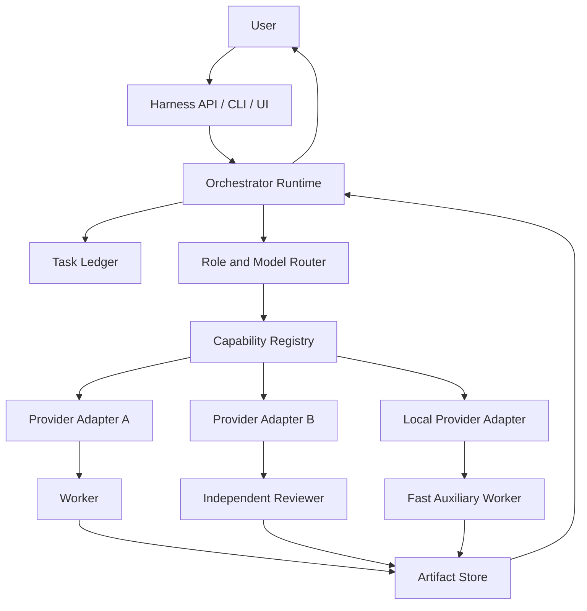

# Synorch Multi-Provider Agent Harness — Gelecek Vizyonu

> Durum: Öneri ve gelecek planı
> Uygulama durumu: Henüz uygulanmadı
> Son güncelleme: 2026-09-22
> İlişkili mevcut belge: [AI Orchestration Architecture](./AI-ORCHESTRATION-ARCHITECTURE.md)

## 1. Yönetici Özeti

Synorch bugün Codex ve Claude Code gibi host agent ortamları için provider-bağımsız agent, skill ve protokol yapısı üreten bir Node.js CLI'dır. `inspect`, `init`, `sync` ve `doctor` komutlarıyla bir repository veya workspace içinde orchestration sözleşmeleri kurar ve doğrular. Sürekli çalışan bir agent runtime'ı değildir; model çağrısı yapmaz, provider hesaplarına bağlanmaz ve worker süreçlerini kendisi işletmez.

Bu belge, Synorch'un ileride dönüşebileceği **multi-provider agent harness** vizyonunu tanımlar. Bu gelecekteki katman; kullanıcının izin verdiği farklı AI provider hesaplarını güvenli biçimde bağlayabilecek, ana orchestrator altında farklı modelleri farklı rollerde çalıştırabilecek, görev durumunu kalıcı olarak tutabilecek ve modeller arası implementasyon–inceleme akışını yönetebilecektir.

Örnek hedef akış:

```text
Kullanıcı
   │
   ▼
Ana Orchestrator
   ├── Provider A / Model X → analiz ve planlama
   ├── Provider B / Model Y → implementasyon
   ├── Provider C / Model Z → bağımsız inceleme
   └── Yerel model          → düşük maliyetli yardımcı işler
```

Model ve provider adları burada yalnızca örnektir. Gerçek destek, ilgili provider'ın resmî kimlik doğrulama yollarına, kullanım koşullarına ve çalışma anındaki capability keşfine bağlı olacaktır.

## 2. Neden Bir Harness?

Bir model tek başına muhakeme ve üretim yapabilir; fakat güvenilir bir yazılım geliştirme organizasyonu için aşağıdaki işletim sorumlulukları ayrıca gerekir:

- Görevi analiz etme ve alt işlere ayırma.
- Her alt iş için uygun rol ve modeli seçme.
- Worker'lara yeterli fakat sınırlı context verme.
- Dosya sahipliği ve izolasyonu yönetme.
- Görev, deneme ve onay durumunu kalıcı tutma.
- Timeout, retry, iptal ve hata kurtarma davranışlarını uygulama.
- Implementasyon ile bağımsız review'u ayırma.
- Provider kullanımını, kotayı ve maliyeti gözlemleme.
- Yapılan her önemli kararı ve kanıtı denetlenebilir biçimde kaydetme.

Bu sorumlulukları üstlenen işletim katmanı **agent harness** olarak adlandırılır.

## 3. Bugünkü Synorch ile İlişkisi

Gelecekteki harness mevcut projeyi geçersiz kılmayacaktır. Bugünkü yapı, harness'in provider-bağımsız sözleşme ve politika çekirdeğini oluşturabilir.

```text
Synorch Core
├── Agent ve skill sözleşmeleri
├── Task/context/completion packet şemaları
├── Risk, onay ve doğrulama protokolleri
└── Provider-bağımsız rol ve capability dili

Synorch CLI
├── syn inspect
├── syn init
├── syn sync
└── syn doctor

Synorch Harness / Runtime
├── Provider authentication
├── Model ve capability registry
├── Orchestrator ve worker lifecycle
├── Task ledger ve scheduler
├── İzolasyon, review ve recovery
└── Kullanım, maliyet ve audit kayıtları

Opsiyonel Synorch UI
├── Hesap ve provider bağlantıları
├── Task görünümü
├── Approval ve müdahale ekranları
└── Kullanım ve sağlık panelleri
```

Kısa vadede CLI hafif ve öngörülebilir kalmalıdır. Runtime aynı repository içinde ayrı bir paket olarak başlayabilir; ürün ve güvenlik sınırları olgunlaştığında ayrı repository kararı yeniden değerlendirilebilir.

## 4. Terminoloji

### Ana orchestrator

Kullanıcı hedefini alan; analiz, planlama, görev dağıtımı, izleme, review sentezi ve nihai rapordan sorumlu kontrol düzlemi agent'ıdır. Varsayılan olarak ürün dosyalarını doğrudan değiştirmez.

### Worker

Sınırlandırılmış bir görev paketi üzerinde çalışan agent örneğidir. Implementer, explorer, debugger veya reviewer gibi bir role sahip olabilir.

### Provider

Bir modele erişim sağlayan servis veya yerel çalışma ortamıdır. OAuth, device-code, API key, kurumsal gateway ya da yerel endpoint gibi farklı kimlik doğrulama biçimleri olabilir.

### Model

Bir provider üzerinden erişilen muhakeme veya üretim motorudur. Model kimliği, provider kimliğinden ayrı tutulmalıdır.

### Harness

Orchestrator ve worker'ların görev, context, araç, kimlik, izolasyon, doğrulama ve lifecycle yönetimini yapan işletim sistemidir.

### Runtime

Harness politikalarını gerçekten çalıştıran, oturumlar arasında durum saklayabilen uzun ömürlü süreç veya servisler bütünüdür.

## 5. Hedefler

- Farklı provider'lardaki modelleri tek görev grafiğinde birlikte çalıştırmak.
- Model adları yerine rol ve capability odaklı yönlendirme yapmak.
- Kullanıcının mevcut hesaplarını yalnızca resmî ve izinli yöntemlerle bağlamak.
- Provider değişse bile aynı task ve evidence sözleşmelerini korumak.
- Ana orchestrator, implementer ve reviewer rollerini birbirinden ayırmak.
- Görevleri kesinti sonrası devam ettirebilmek.
- Sessiz fallback yerine görünür ve onaylı recovery uygulamak.
- Context maliyetini sınırlamak ve yeniden keşfi azaltmak.
- Her önemli karar, model çağrısı ve dosya değişikliği için audit izi bırakmak.
- Yerel, uzak veya hibrit deployment seçeneklerini destekleyebilecek sınırlar kurmak.

## 6. Kapsam Dışı Hedefler

İlk sürümlerde aşağıdakiler hedeflenmemelidir:

- Her provider'ın tüketici aboneliğini destekliyormuş gibi davranmak.
- Tarayıcı cookie'lerini veya kapalı kimlik doğrulama akışlarını taklit etmek.
- Provider kullanım koşullarını aşmaya yönelik yöntemler geliştirmek.
- Kullanıcı onayı olmadan ücretli veya yüksek maliyetli modele geçmek.
- Modellerin birbirleriyle sınırsız ve denetimsiz konuştuğu bir swarm kurmak.
- İlk aşamada genel amaçlı bir workflow otomasyon platformuna dönüşmek.
- Synorch CLI'nin mevcut deterministik scaffold davranışını runtime bağımlılığına bağlamak.

## 7. Önerilen Üst Düzey Mimari



### Control flow

Control flow; onay, routing, durum geçişi, retry ve lifecycle kararlarını taşır. Ana orchestrator ve task ledger bu akışın merkezindedir.

### Data flow

Data flow; context packet, diff, test çıktısı, review bulgusu ve diğer artifact'ları taşır. Büyük artifact'lar prompt içine kopyalanmak yerine referansla aktarılmalıdır.

Control flow ile data flow ayrılmalıdır. Credential, task context'inin veya artifact paketinin parçası olmamalıdır.

## 8. Provider Kimlik Doğrulama ve Credential Güvenliği

Her provider adapter yalnızca provider'ın resmî olarak desteklediği yöntemleri kullanmalıdır:

- OAuth 2.0 veya device-code.
- Kullanıcının açıkça sağladığı API key.
- Kurumsal kimlik sağlayıcı veya gateway.
- Kullanıcının yönettiği yerel endpoint.

Credential kuralları:

- Token ve secret'lar task ledger'a, loglara veya model context'ine yazılmaz.
- İşletim sistemi credential vault'u veya eşdeğer şifreli storage kullanılır.
- Refresh token erişimi en az yetki ilkesiyle sınırlandırılır.
- Log redaction varsayılan ve test edilmiş olmalıdır.
- Provider bağlantısı kaldırıldığında ilişkili credential geri alınabilir biçimde silinmelidir.
- Worker yalnızca kendisi için oluşturulan kısa ömürlü provider handle'ını görmelidir.
- Credential export varsayılan olarak yasak olmalıdır.

Bir aboneliğin varlığı, üçüncü taraf kullanım hakkı anlamına gelmez. Capability keşfi şu ayrımı açıkça göstermelidir:

| Erişim türü | Örnek durum | Harness davranışı |
|---|---|---|
| Resmî OAuth/device-code | Provider açıkça destekliyor | Kullanıcı onayıyla bağlanabilir |
| Resmî API key | Kullanıcı anahtar sağlıyor | Ayrı billing ve kota gösterilir |
| Tüketici aboneliği belirsiz | Plan kapsamı belgelenmemiş | Destek varsayılmaz, açık uyarı gösterilir |
| Kapalı/tersine mühendislik akışı | Resmî destek yok | Kullanılmaz |
| Yerel model | Kullanıcı endpoint'i yönetiyor | Sağlık ve capability probe uygulanır |

## 9. Provider Adapter Contract

Her adapter ortak bir sözleşmeyi uygulamalıdır:

```yaml
provider_id: provider-a
authentication:
  methods: [oauth_device, api_key]
capabilities:
  model_listing: supported
  streaming: supported
  tool_calling: supported
  per_worker_model_selection: supported
  usage_reporting: degraded
  cancellation: supported
  session_resume: unsupported
```

Adapter en az şu operasyonları tanımlamalıdır:

- `authenticate`
- `refreshAuthentication`
- `listModels`
- `probeCapabilities`
- `startInvocation`
- `streamInvocation`
- `cancelInvocation`
- `readUsage`
- `revokeAuthentication`

Her capability `supported`, `degraded` veya `unsupported` olarak raporlanmalıdır. Desteklenmeyen özellik varmış gibi taklit edilmemelidir.

## 10. Model ve Capability Registry

Routing kararı yalnızca model adına bakmamalıdır. Registry çalışma anında şu gerçekleri tutmalıdır:

- Provider ve model kimliği.
- Context kapasitesi.
- Tool calling ve structured output desteği.
- Kodlama, review, görüntü veya uzun-context gibi doğrulanmış capability'ler.
- Latency ve maliyet sınıfı.
- Rate limit ve kalan kota bilgisi mevcutsa onun özeti.
- Kimlik doğrulama sağlığı.
- Veri yerleşimi ve kurumsal politika etiketleri.
- Son doğrulama zamanı ve evidence kaynağı.

Statik config yalnızca tercih bildirir. Gerçek kullanılabilirlik capability probe ile doğrulanmalıdır.

## 11. Rol Bazlı Model Yönlendirme

Canonical politika model adı yerine ihtiyacı tarif etmelidir:

```yaml
roles:
  orchestrator:
    requires: [strong_reasoning, long_context, delegation]
  implementer:
    requires: [coding, tool_calling, patch_generation]
  reviewer:
    requires: [code_review, structured_output]
    prefers: [independent_provider]
  fast_worker:
    requires: [low_latency]
```

Router şu sırayla karar vermelidir:

1. Kullanıcının açık provider/model seçimi.
2. Güvenlik, veri yerleşimi ve görev politikaları.
3. Rolün zorunlu capability'leri.
4. Provider sağlık ve kota durumu.
5. Kullanıcı tarafından belirlenen maliyet/latency tercihleri.
6. Açıklanabilir tie-break kuralı.

Seçilen model kullanılamıyorsa sessiz fallback yapılmaz. Harness nedeni, alternatifleri ve maliyet etkisini göstererek kullanıcı onayı ister.

## 12. Cross-Provider Implementasyon ve Review Örneği

```text
1. Ana orchestrator görevi ve kabul kriterlerini oluşturur.
2. Router coding capability'si uygun olan implementer'ı seçer.
3. Implementer izole çalışma alanında değişikliği yapar.
4. Harness diff, komut ve test kanıtlarını completion packet'a bağlar.
5. Router mümkünse farklı provider'dan bağımsız reviewer seçer.
6. Reviewer plan, diff ve kanıtları inceler.
7. Bulgular varsa orchestrator yeni bir delta packet üretir.
8. Implementer düzeltir; reviewer yalnız gerekli alanı yeniden kontrol eder.
9. Ana orchestrator kabul kriterlerini sentezleyip kullanıcıya raporlar.
```

Farklı provider kullanımı bağımsızlığı güçlendirebilir, fakat tek başına kalite garantisi değildir. Reviewer'ın ayrı context, görev ve kanıt sözleşmesine sahip olması gerekir.

## 13. Task Ledger ve Durum Makinesi

Runtime görevleri yalnız sohbet geçmişinde tutmamalıdır. Kalıcı task ledger en az şu bilgileri içermelidir:

- Task, run ve attempt kimlikleri.
- Kullanıcı hedefi ve onaylanmış plan sürümü.
- Risk seviyesi.
- Görev bağımlılık grafiği.
- Atanmış rol, provider ve model.
- Owned, readable ve forbidden path'ler.
- Context packet sürümü ve digest'i.
- Approval kayıtları.
- Artifact ve evidence referansları.
- Retry, timeout ve failure nedeni.
- Kullanım ve maliyet özeti.

Önerilen lifecycle:

```text
DRAFT
  ↓
AWAITING_APPROVAL
  ↓
READY
  ↓
RUNNING
  ├── NEEDS_CONTEXT ──→ RUNNING
  ├── BLOCKED ────────→ READY
  ├── FAILED ─────────→ RETRY_PENDING
  ├── CANCELLED
  └── VERIFYING
          ↓
       REVIEWING
          ├── CHANGES_REQUESTED ──→ READY
          └── COMPLETED
```

Her durum geçişi aktör, zaman, neden ve önceki state ile kaydedilmelidir.

## 14. Context, Completion ve Review Packet'ları

Provider'lar arasında ortak dil olarak typed packet'lar kullanılmalıdır.

### Task context packet

- Objective ve rationale.
- Risk seviyesi ve onay referansı.
- Owned/read/forbidden scope.
- Kaynak ve revision içeren doğrulanmış gerçekler.
- İlgili semboller ve artifact referansları.
- Kabul kriterleri.
- Doğrulama komutları.
- Non-goals.
- Stop ve escalation koşulları.

### Worker completion packet

- Durum ve kısa özet.
- Değişen dosyalar.
- Alınan kararlar.
- Çalıştırılan komutlar ve exit code'lar.
- Her kabul kriteri için evidence.
- Atlanan kontroller ve gerekçeleri.
- Kalan riskler.

### Review packet

- İncelenen plan, diff ve evidence digest'leri.
- Reviewer provider/model ve bağımsızlık bilgisi.
- Severity sınıflı bulgular.
- Her bulgu için dosya, konum, etki ve öneri.
- Kabul, değişiklik talebi veya bloke kararı.

Büyük konuşma geçmişleri worker'lara kopyalanmamalıdır. Follow-up görevleri tam paket yerine versioned delta packet kullanmalıdır.

## 15. İzolasyon ve Paralellik

Önerilen başlangıç politikası:

- Tek dosya ağacında yalnız ayrık ownership'e sahip işler paralel çalışır.
- Aynı dosya veya ortak generated artifact üzerinde işler serialize edilir.
- Geniş, yüksek riskli veya çakışma ihtimali bulunan işler worktree/izole checkout kullanır.
- Bir integration owner, worker sonuçlarını hedef branch'e taşır.
- Worker başka worker'ın değişikliğini geri alamaz.
- Ownership ihlali otomatik olarak durdurulur ve orchestrator'a yükseltilir.

Provider worktree desteklemiyorsa capability `degraded` olmalı ve daha güvenli seri çalışma uygulanmalıdır.

## 16. Approval, Retry, Timeout ve Fallback

### Approval

Kullanıcı onayı en az şu durumlarda gereklidir:

- Planın uygulamaya geçmesi.
- Yeni ücretli provider veya daha pahalı model kullanımı.
- Destructive işlem.
- Credential veya dış sisteme yazma.
- Plan dışı scope genişlemesi.
- Sessiz olmayan model/provider değişikliği.

### Retry

Retry yalnızca materially changed bir hipotez veya talimatla yapılır. Aynı prompt'u sınırsız tekrar etmek yasaktır. Attempt sayısı ve maliyeti ledger'da görünmelidir.

### Timeout ve cancellation

Harness provider isteğini iptal edebilmeli, worker state'ini kapatmalı ve üretilmiş kısmi artifact'ları işaretlemelidir. İptal edilmiş çıktı tamamlanmış kanıt olarak kullanılamaz.

### Fallback

Fallback politikası kullanıcı tarafından açıkça tanımlanır. Varsayılan davranış sessiz provider/model değişimi değil, durup açıklama ve onay istemektir.

## 17. Kullanım, Kota ve Maliyet

Farklı provider'lar kullanım bilgisini farklı ayrıntıda sunabilir. Harness şu ayrımı korumalıdır:

- Provider'ın doğruladığı token/maliyet verisi.
- Harness'in tahmini kullanım verisi.
- Abonelik içinde olduğu varsayılan fakat doğrulanamayan kullanım.

Tahminler gerçek fatura gibi gösterilmemelidir. Kullanıcı görev veya provider bazında bütçe sınırı belirleyebilmelidir. Bütçe aşıldığında yeni çağrı başlatılmamalı ve aktif çağrıların davranışı açık politika ile belirlenmelidir.

## 18. Auditability ve Observability

Her run için şu kayıtlar erişilebilir olmalıdır:

- Hangi kararın kim tarafından verildiği.
- Hangi provider/modelin neden seçildiği.
- Gönderilen packet'ın digest'i.
- Tool ve dosya erişim özeti.
- Üretilen artifact'lar.
- Test ve review kanıtları.
- Retry, fallback ve approval olayları.
- Süre, kullanım ve maliyet bilgisi.

Loglar secret, token veya gereksiz kullanıcı içeriği taşımamalıdır. Ayrıntılı tracing opt-in olabilir; temel audit izi varsayılan olmalıdır.

## 19. Tehdit Modeli

İlk güvenlik tasarımı en az şu riskleri kapsamalıdır:

- Credential sızıntısı.
- Prompt injection ile başka provider veya tool'a yetkisiz erişim.
- Worker'ın ownership dışına yazması.
- Kötü niyetli repository talimatlarının constitutional kuralları aşması.
- Log veya artifact üzerinden secret taşınması.
- Provider endpoint spoofing ve SSRF.
- Model çıktısının doğrudan shell komutu olarak güvenilmesi.
- Supply-chain kaynaklı skill/plugin manipülasyonu.
- Reviewer ve implementer'ın aynı kirli context'i paylaşması.
- Bütçe tüketen sonsuz retry veya agent döngüsü.

Savunmalar arasında credential isolation, allowlist, sandbox, path sınırları, approval gates, signed/digested artifact'lar, maksimum attempt sayısı ve immutable audit kayıtları bulunmalıdır.

## 20. Deployment Seçenekleri

### Yerel runtime

Tek geliştiricinin makinesinde çalışır. Credential kontrolü ve repository erişimi basittir; cihaz kapandığında görevler durur.

### Yerel daemon ve UI

Arka planda çalışan servis, CLI ve masaüstü/web arayüzü sunar. Uzun süren görevler ve bildirimler için uygundur.

### Self-hosted server

Ekip kullanımı, merkezi policy ve shared queue sağlar. Multi-tenant izolasyon ve secret yönetimi daha yüksek güvenlik gerektirir.

### Hibrit model

Control plane sunucuda; repository ve tool execution yerel runner'da olabilir. Kurumsal veri yerleşimi için değerlidir fakat protokol ve kimlik tasarımını zorlaştırır.

İlk deneysel runtime için yerel çalışma önerilir. Multi-user cloud hizmeti ilk aşama hedefi olmamalıdır.

## 21. Hermes Agent ile İlişki

Hermes Agent; provider yapılandırma, model seçimi, OAuth/API bağlantıları ve agent çalışma deneyimi açısından önemli bir ilham kaynağıdır. Synorch'un önerilen farklılaşması şunlardır:

- Yazılım geliştirme görevleri için açık orchestrator/worker/reviewer rolleri.
- Provider-neutral typed task ve evidence packet'ları.
- Risk-orantılı bağımsız review.
- Dosya ownership ve worktree izolasyonu.
- Repository-aware discovery ve skill activation.
- No-silent-fallback ve approval-first routing.
- CLI scaffold ile runtime sözleşmelerinin aynı core'u paylaşması.

Bu belge Hermes uyumluluğu veya mevcut Hermes özelliklerinin yeniden uygulanacağı taahhüdü değildir. Uygulama öncesinde ilgili projelerin lisansları, güncel dokümanları ve provider kullanım koşulları ayrıca incelenmelidir.

## 22. Aşamalı Yol Haritası

### Aşama 0 — Contract foundation

- Canonical Agent Manifest v1.
- Canonical Skill Contract v1.
- Task Context, Completion ve Review Packet v2.
- Agent ve protocol registry.
- Provider capability sözlüğü.
- `doctor` için contract doğrulama ve negatif testler.

Çıkış kriteri: Runtime olmadan da bütün canonical sözleşmeler generated projede tutarlı ve makine tarafından doğrulanabilir olmalıdır.

### Aşama 1 — Yerel tek-provider harness prototipi

- Tek provider adapter.
- Yerel task ledger.
- Bir orchestrator ve bir worker lifecycle'ı.
- Approval, cancellation ve timeout.
- Artifact store ve temel audit log.

Çıkış kriteri: Tek görev kesinti sonrası devam edebilmeli ve her durum geçişi açıklanabilmelidir.

### Aşama 2 — Multi-provider routing

- En az iki resmî provider adapter.
- Capability discovery.
- Rol bazlı model routing.
- Cross-provider implementer/reviewer akışı.
- Kota ve kullanım görünürlüğü.

Çıkış kriteri: Bir provider'da implementasyon, diğerinde bağımsız review kullanıcı tarafından görünür routing kararıyla tamamlanabilmelidir.

### Aşama 3 — İzolasyon ve recovery

- Worktree veya eşdeğer sandbox yönetimi.
- Ownership enforcement.
- Retry ve delta-context akışı.
- Worker crash recovery.
- Stale context ve artifact digest kontrolleri.

Çıkış kriteri: Paralel worker'lar birbirlerinin değişikliklerini bozamamalı; yarım kalan görev kontrollü biçimde devam edebilmelidir.

### Aşama 4 — Yerel dashboard

- Provider bağlantı durumu.
- Task DAG ve worker görünümü.
- Approval ve intervention ekranları.
- Maliyet, kota ve audit paneli.

Çıkış kriteri: Kullanıcı terminal logu okumadan aktif görevleri ve bekleyen kararları anlayabilmelidir.

### Aşama 5 — Ekip ve uzak runner araştırması

- Multi-user authorization.
- Merkezi policy.
- Uzak ve yerel runner protokolü.
- Kurumsal secret ve data-residency entegrasyonları.

Bu aşama, yerel runtime güvenilirliği kanıtlanmadan başlatılmamalıdır.

## 23. Başarı Ölçütleri

- Kullanıcı bir görev için orchestrator, implementer ve reviewer rollerini farklı provider'lara atayabilir.
- Her atama capability ve policy kanıtıyla açıklanabilir.
- Provider kullanılamadığında sessiz fallback gerçekleşmez.
- Görev kesintiden sonra ledger üzerinden devam edebilir.
- Worker yalnızca atanmış dosya ve araç kapsamına erişebilir.
- Her kabul kriteri bir evidence kaydıyla eşleştirilir.
- Reviewer implementer'dan bağımsız packet ve context alır.
- Credential hiçbir task, prompt, log veya artifact içinde görünmez.
- Kullanıcı provider, görev ve run bazında kullanım/maliyet durumunu görebilir.
- Mevcut Synorch CLI runtime kurulmadan çalışmaya devam eder.

## 24. Açık Kararlar

Uygulama başlamadan önce şu kararlar ayrıca kayda bağlanmalıdır:

1. Runtime aynı monorepo içinde ayrı paket mi, ayrı repository mi olacak?
2. Ana orchestrator yerel süreç mi, provider-hosted agent mı olacak?
3. Task ledger için ilk kalıcı storage biçimi nedir?
4. Credential vault için platformlar arası minimum sözleşme nedir?
5. Worktree hangi risk seviyesinde zorunlu olacaktır?
6. Debugger kod yazabilen worker mı, yalnız RCA üreten rol mü olacaktır?
7. Reviewer için farklı provider zorunluluğu mu, tercih mi olacaktır?
8. Kullanım ve bütçe sınırı provider verisi eksikken nasıl uygulanacaktır?
9. Hangi provider'lar ilk resmî adapter setine alınacaktır?
10. UI, runtime ile aynı süreçte mi, ayrı istemci olarak mı çalışacaktır?

## 25. Mevcut Repository İçin Hazırlık Backlog'u

Harness geliştirmesine başlamadan önce mevcut Synorch çekirdeğinde şu işler önerilir:

- Agent manifestlerini amaç, yetki, input, output, escalation ve completion sözleşmeleriyle derinleştirmek.
- Skill'ler için makine tarafından doğrulanabilir canonical contract oluşturmak.
- Agent registry eklemek ve `assigned_role` değerlerini registry'ye bağlamak.
- Context ve completion packet dokümanlarıyla JSON Schema'ları tek kaynağa indirmek.
- Review packet ve task ledger şemalarını eklemek.
- Provider adapter capability sözleşmesini canonical hâle getirmek.
- `doctor` kapsamını agent, protocol, provider adapter ve schema bütünlüğüne genişletmek.
- Trivial, standard, high-risk, needs-context, retry ve overlapping-ownership senaryoları için contract testleri yazmak.
- Mevcut mimari belgede uygulanmış davranışlar ile gelecek kararlarını açıkça ayırmak.

## 26. Sonuç

Önerilen multi-provider harness, Synorch'un bugünkü CLI kapsamından önemli ölçüde daha büyük bir üründür. Bununla birlikte mevcut provider-neutral sözleşme yaklaşımı, progressive disclosure, risk-orantılı doğrulama ve orchestrator/worker ayrımı bu gelecekteki sistem için doğru bir temel sunmaktadır.

Önerilen yol, mevcut CLI'yi doğrudan uzun ömürlü runtime'a dönüştürmek değil; önce ortak core sözleşmelerini güçlendirmek, ardından aynı sözleşmeleri tüketen ayrı bir yerel harness katmanı geliştirmektir. Böylece Synorch hem hafif bir project bootstrap aracı olarak kalabilir hem de ileride farklı provider'lardaki modelleri tek bir güvenilir geliştirme organizasyonunda birleştiren çalışma motoruna dönüşebilir.
